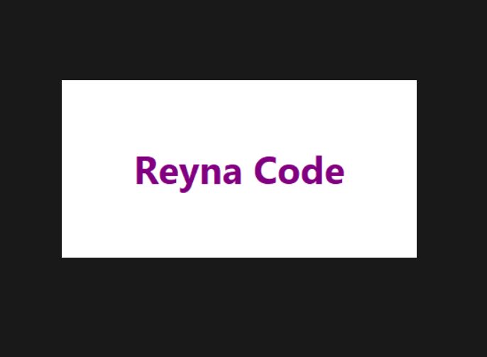
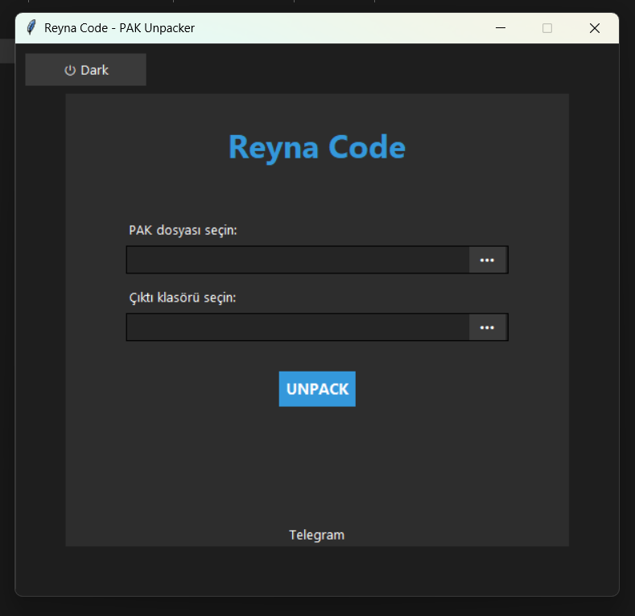

# Reyna Code - PAK Unpacker


---

 


 

---

---

**Reyna Code - PAK Unpacker**, `.pak` uzantılı dosyaları Zstandard algoritması ile açmanıza yardımcı olan basit, hızlı ve temalı bir Windows uygulamasıdır.

---

## 🖥️ Özellikler

- ✅ Kolay kullanımlı grafik arayüz (GUI)
- 🌙 Koyu / ☀️ Açık tema desteği
- 📦 Zstandard sözlük desteği (otomatik çıkarma)
- 🚀 Çoklu iş parçacığı ile hızlı işlem
- 📁 `.pak` dosyalarını `.dat` olarak çıkarır
- 🔗 Telegram üzerinden destek bağlantısı

---

## 🔧 Kurulum ve Çalıştırma

### 1. Adım: Gerekli bağımlılığı yükleyin

```bash
pip install -r requirements.txt
```

---

## Uygulamayı çalıştırın
- ReynaCode.exe dosyasına çift tıklayarak uygulamayı başlatın.
- Açılan arayüzde:
- .pak dosyasını seçin
- Çıkış klasörünü belirtin
- UNPACK butonuna tıklayın
- Uygulama, .pak içindeki verileri otomatik olarak ayrıştırır ve .dat dosyaları halinde belirtilen klasöre kaydeder.

---

## 📬 Destek & İletişim
- Geri bildirimde bulunmak, hata bildirmek veya destek almak için:
Telegram Kanalı: https://t.me/rynacode
