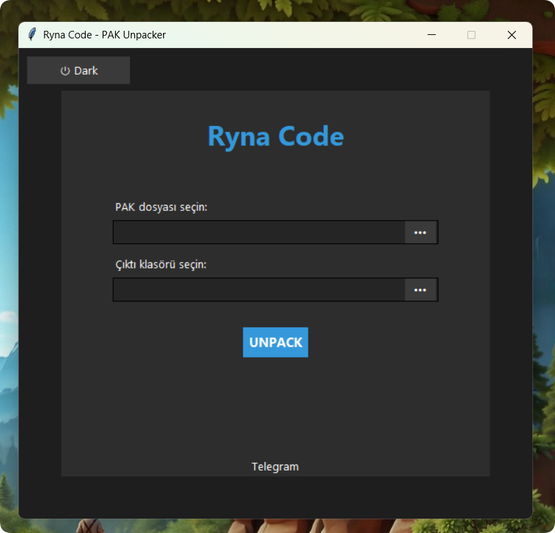

<h1 align="center">Ryna Code - PAK Unpacker</h1>

<p align="center">
  
</p>

<p align="center">
  
  
  
</p>

---

<p align="center">
  
</p>

---

## ✨ Tanıtım

**Ryna Code - PAK Unpacker**, `.pak` uzantılı dosyaları **Zstandard algoritması** ile hızlıca ve pratik bir şekilde ayıklamanızı sağlayan, temalı ve kullanıcı dostu bir **Windows** uygulamasıdır.

---

## 🖥️ Özellikler

- ✅ Kullanımı kolay ve modern **grafik arayüz (GUI)**
- 🌗 **Açık / Koyu tema** desteği
- 📦 Otomatik **Zstandard sözlük** kullanımı
- 🚀 **Çoklu iş parçacığı** desteği ile yüksek hız
- 📁 `.pak` dosyalarını `.dat` olarak dışa aktarma
- 🔗 **Telegram** üzerinden topluluk desteği
---

## ⚙️ Kurulum ve Kullanım

### 1. Gereksinimleri Yükleyin

```bash
pip install -r requirements.txt
```

---

## 📬 Destek & İletişim

Her türlü geri bildirim, öneri veya destek talepleriniz için:

**Telegram Kanalı:** [https://t.me/rynacode](https://t.me/rynacode)

---

> Geliştirici: **SethConfig**  
> Lisans: MIT License
